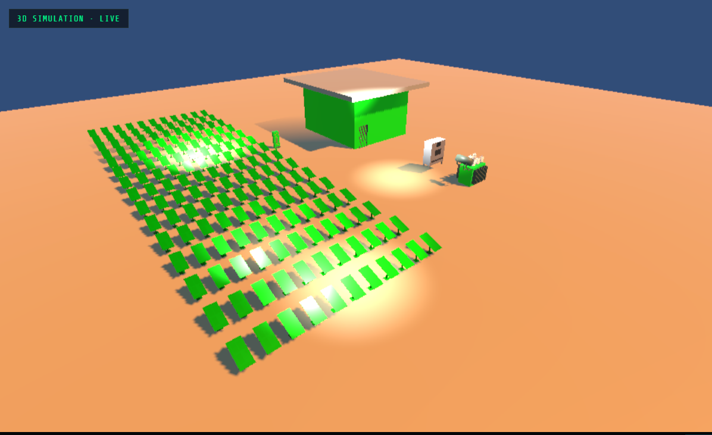
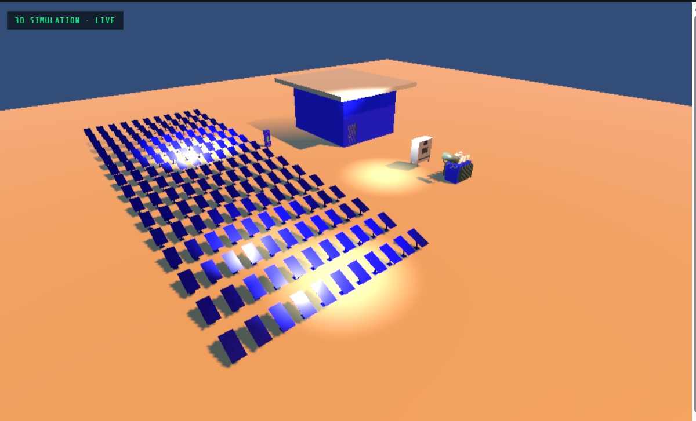
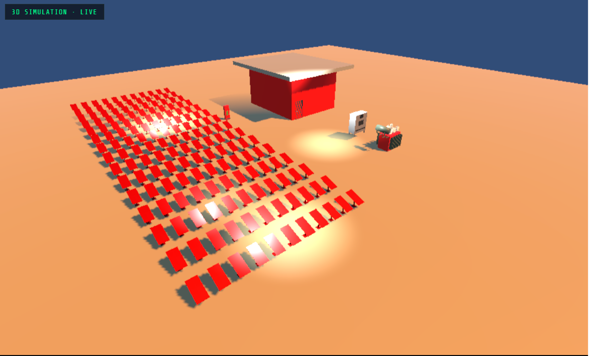
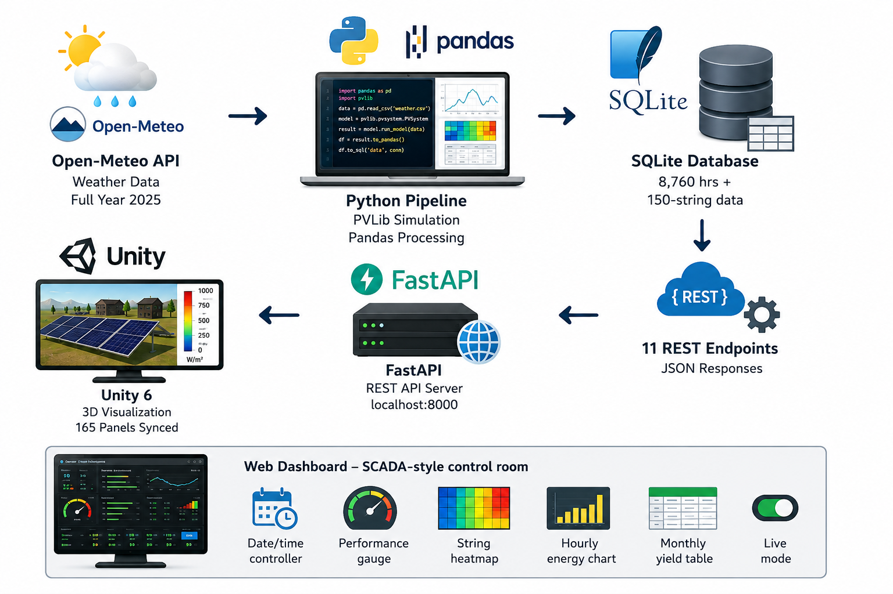

# 🌞 Solar Power Plant Digital Twin

A full-stack Digital Twin of a 400kW solar power plant — integrating real weather data, physics-based PV simulation, string-level fault monitoring, a REST API backend, and live 3D visualization in Unity 6.

>A project by an Electrical Engineering student at VJTI Mumbai, targeting ER&D roles in Industrial IoT, Digital Twin, and Energy Systems.

## 🔍 Problem Statement

Solar power plants operate continuously across hundreds of panels and inverters, generating thousands of data points every hour. Traditional monitoring systemsv report plant-wide averages — which means a single underperforming string, a degraded inverter, or an early-stage fault stays invisible until it causes measurable revenue loss.

There is no easy way to:
- Visualize equipment health spatially across the plant
- Isolate faults to a specific string out of 150
- Simulate "what was happening at 2PM on a cloudy day in February"
- Connect physics-level PV behavior to a live 3D model
---

## 🎥 Demo Video

[](https://youtu.be/vGUKVmpQfjw)

---

## 🖼️ Screenshots

### Normal Operation — All 165 Panels Synced GREEN


### Night Mode — BLUE with String-Level Health Grid


### Fault / Low Output — RED


---

## 🏗️ System Architecture




---

## ⚡ Tech Stack


---

## 🌱 Plant Specifications

| Parameter | Value |
|---|---|
| Plant Capacity | ~400 kW (495 kWp installed) |
| Location | Koregaon, Maharashtra (17.7°N, 74.16°E) |
| Panel Model | Canadian Solar CS6X 300W |
| Inverter | ABB PVI Central 100kW × 5 |
| Panel Tilt | 20° South-facing |
| String Config | 11 panels/string × 30 strings/inverter |
| Total Strings | 150 (monitored independently) |
| Total Panels | 1,650 (165 visualized in Unity) |
| Simulation Period | Full Year 2025 (8,760 hours) |
| Annual Yield | ~660 MWh/year (~1,650 kWh/kWp) |

---

## 🗂️ Project Structure

```
solar-plant-digital-twin/
│
├── data_fetching.py        # Stage 1: Open-Meteo API — fetch full year weather data
├── data_cleaning.py        # Stage 2: Pandas — process, filter, visualize
├── pvlib_simulation.py     # Stage 3: PVLib — physics-based plant simulation
├── database.py             # Stage 4: SQLite — plant + string-level data generation
├── query_test.py           # Stage 4: SQL queries — monthly analysis
├── api.py                  # Stage 5: FastAPI — 11 REST endpoints
│
├── waeather_data.csv       # Raw weather data — Open-Meteo historical archive
├── solar_plant.db          # SQLite database — plant_performance + string_data
│
├── dashboard.html          # Stage 6: Web dashboard — SCADA-style control room
├── assets/                 # Screenshots and charts
│
└── SolarPlant_DigitalTwin/ # Unity 6 project
    └── Assets/
        ├── Scripts/
        │   ├── APIManager.cs       # HTTP polling — UnityWebRequest coroutine
        │   └── PlantVisualizer.cs  # Multi-renderer real-time color sync
        ├── Models/                 # 5 Blender-modeled FBX assets (165 panels)
        └── Materials/
```

---

## 🎨 3D Asset Modeling — Blender

All plant assets were **modeled from scratch in Blender** — no pre-made assets used.

| Asset | Details |
|---|---|
| ☀️ Solar Array | 165-panel field (11×15 grid) using Array modifiers, with cell-grid texture |
| ⚡ Inverter Cabinet | ABB-style cabinet with ventilation grilles and control panel |
| 🔌 Power Transformer | Oil-cooled transformer with cooling fins and HV/LV bushings |
| 🏭 HT Switchgear Bay | High tension bay with insulators and bus bars |
| 🏠 Substation Building | Control room with doors, windows, and cable routing |

Exported as FBX with applied transforms and imported into Unity 6. Every individual panel mesh is grabbed via `GetComponentsInChildren<Renderer>()` so the entire array changes color in sync, not just one mesh.

---

## 📊 Simulation Results

### Monthly Energy Yield

| Month | Avg Output (kW) | Total Energy (kWh) | Notes |
|---|---|---|---|
| January | 164.66 | 56,149 | Clear winter sky |
| February | 182.53 | 56,951 | Peak clear sky |
| March | 177.96 | 66,201 | Equinox — sun overhead |
| April | 174.01 | 62,644 | High irradiance |
| May | 142.39 | 52,685 | Pre-monsoon haze |
| June | 139.04 | 51,028 | Monsoon begins |
| July | 115.66 | 44,530 | Peak monsoon — lowest |
| August | 136.78 | 51,157 | Monsoon continues |
| September | 144.48 | 51,724 | Equinox — recovery |
| October | 155.58 | 56,321 | Post-monsoon clear |
| November | 168.13 | 55,482 | Clear sky returns |
| December | 167.73 | 54,847 | Clear winter sky |

**Peak output hour:** 349.9 kW on 2025-03-22 13:00 (GHI: 984 W/m²)
**Annual yield:** ~660 MWh/year (~1,650 kWh/kWp — within MNRE benchmarks for Maharashtra: 1,400–1,700 kWh/kWp)

---

## 🔲 String-Level Fault Monitoring

Real solar plants monitor strings (groups of series-connected panels) independently — a single shading or connector fault gets averaged away at the plant level but is immediately visible at the string level.

**How it's simulated:**
- 150 strings (11 panels × 30 strings/inverter × 5 inverters)
- Each string's output = plant total ÷ 150, with realistic ±5% Gaussian variation
- ~2% of hours randomly inject a fault — one string drops to 20–40% output
- Visualized as a 15×10 color-coded heatmap grid on the dashboard, with hover tooltips showing exact kW per string

This is exposed via `GET /plant/strings?datetime_str=...` and rendered live alongside the 3D view and plant-wide metrics.

---

## 🔌 API Endpoints

| Method | Endpoint | Description |
|---|---|---|
| GET | `/` | Health check |
| GET | `/plant/status` | Latest/peak plant reading |
| GET | `/plant/recent` | Last 24 hours of data |
| GET | `/plant/monthly` | Monthly energy summary |
| GET | `/plant/performance_ratio` | Monthly performance ratio vs theoretical |
| GET | `/plant/faults` | Fault detection — hours below 70% expected output |
| GET | `/plant/data` | Plant data for a specific datetime |
| GET | `/plant/strings` | String-level health for a specific datetime |
| POST | `/plant/set_datetime` | Set the active simulation datetime (syncs dashboard ↔ Unity) |
| GET | `/plant/current` | Current plant data based on active simulation datetime |

Interactive docs available at: `http://127.0.0.1:8000/docs`

---

## 🎮 Unity Real-Time Visualization

Unity polls `/plant/current` every 3 seconds using `UnityWebRequest` coroutines. **Every renderer across all 165 panel meshes** updates simultaneously — not just a single object — using `GetComponentsInChildren<Renderer>()` across each equipment group.

| Color | Plant Status | Condition |
|---|---|---|
| 🟢 Green | Normal Operation | AC Power > 200 kW |
| 🟡 Yellow | Low Output | AC Power 50–200 kW |
| 🔴 Red | Fault / Very Low | AC Power < 50 kW |
| 🔵 Blue | Night Mode | GHI = 0 W/m² |

---

## 🖥️ Web Dashboard Features

- **Live Unity 3D embed** synced with dashboard state
- **Date/time controller** — "time-travel" through any hour of 2025
- **Auto-play mode** — animates through a full day automatically
- **Performance gauge** — live capacity utilisation (0–400kW)
- **Performance Ratio card** — Actual ÷ Theoretical output
- **24-hour energy chart** — full day curve fetched in parallel on date change
- **String-level health heatmap** — 150 strings, color-coded, hover for exact values
- **Monthly yield table** — click any month to jump straight to its peak data
- **Live mode** — polls real-time plant status every 5 seconds

---

## ⚙️ Setup & Run

### Prerequisites
```bash
py -m pip install requests pandas matplotlib pvlib fastapi uvicorn numpy
```

### 1 — Fetch Weather Data
```bash
py data_fetching.py
```

### 2 — Run PVLib Simulation
```bash
py pvlib_simulation.py
```

### 3 — Build Database (plant + string-level data)
```bash
py database.py
```

### 4 — Start API Server
```bash
py -m uvicorn api:app --reload
```
API live at: `http://127.0.0.1:8000`
Docs at: `http://127.0.0.1:8000/docs`

### 5 — Serve Unity WebGL Build
```bash
cd webgl_build
py server.py
```

### 6 — Open the Dashboard
```
http://localhost:8001/dashboard.html
```

---

## 🧠 What I Learned

- Calling REST APIs and parsing JSON in Python
- Time-series data processing and resampling with Pandas
- Solar physics — GHI, DNI, DHI, cell temperature modeling, performance ratio
- PVLib ModelChain for full plant simulation with real panel/inverter specs
- String voltage/MPPT matching — sizing modules-per-string against inverter limits
- Statistical simulation with NumPy — Gaussian noise, randomized fault injection
- SQLite database design, indexing, and SQL querying for large time-series datasets
- Building REST APIs with FastAPI, including stateful datetime sync via SQLite
- 3D modeling of industrial equipment from scratch in Blender, including Array modifiers for repeated geometry
- Unity C# scripting — UnityWebRequest, coroutines, multi-renderer material synchronization
- Building a synced web dashboard — Chart.js, SVG gauges, parallel async data fetching
- Debugging full-stack systems end-to-end: Python ↔ SQLite ↔ FastAPI ↔ Unity WebGL ↔ JavaScript

---

## 👤 Author

**Yashwanth Reddy**
Final Year Electrical Engineering — VJTI Mumbai (2026)

[](https://linkedin.com/in/yashwanth-reddy-292998272)
[](https://github.com/yashawanthr952-glitch)

---

## 📄 License

MIT License — free to use and modify with attribution.
